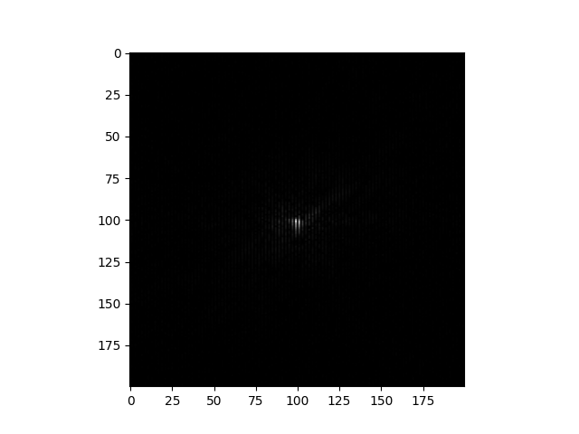
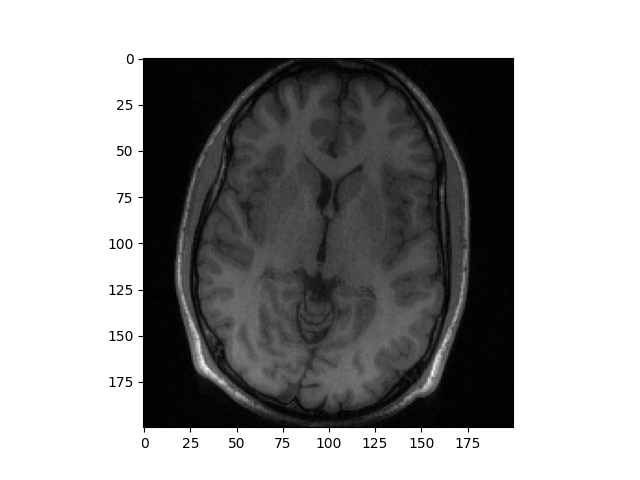

# MRI 병렬 영상 재구성 기법: GRAPPA 구현 (Python)

이 프로젝트는 학부 연구생 시절 진행했던 MRI 병렬 영상 재구성 기법 중 하나인 GRAPPA(GeneRalized Autocalibrating Partially Parallel Acquisitions)를 Python으로 직접 구현한 코드입니다.

## 📜 프로젝트 소개

GRAPPA는 k-space에서 undersampling된 데이터를 복원하여 MRI 촬영 시간을 단축하는 기술입니다. 이 코드는 GRAPPA 알고리즘의 주요 단계인 ACS(Auto-Calibration Signal) 영역 추출, 가중치 계산, 미수집 데이터 보간 과정을 포함하고 있습니다.

## 🔧 사용 기술

- Python 3
- NumPy
- SciPy
- Matplotlib

## ⚙️ 설치 방법

1.  **저장소 복제**
    ```bash
    git clone [https://github.com/YourUsername/grappa-mri-reconstruction.git](https://github.com/YourUsername/grappa-mri-reconstruction.git)
    cd grappa-mri-reconstruction
    ```

2.  **필요한 라이브러리 설치**
    ```bash
    pip install -r requirements.txt
    ```

## ▶️ 실행 방법

아래 명령어를 실행하면 `data` 폴더의 `brain_8ch.mat` 파일을 이용하여 GRAPPA 재구성을 수행하고, 결과 이미지를 `output` 폴더에 `grappa_output.png`로 저장합니다.

```bash
python grappa.py
```

## 🖼️ 실행 결과

 undersampling된 k-space | GRAPPA로 복원된 영상
:-------------------------:|:-------------------------:
  |  

## 💾 데이터

이 프로젝트를 실행하기 위해서는 `brain_8ch.mat` 데이터 파일이 필요합니다.

이 데이터는 Michael Lustig 교수님의 **ESPIRiT MATLAB Toolbox**에서 제공하는 샘플 데이터입니다. 전체 데이터셋 및 원본 코드는 아래 링크의 공식 GitHub 저장소에서 확인하실 수 있습니다.

-   **ESPIRiT 원본 저장소**: [https://github.com/mikgroup/espirit-matlab-and-c](https://github.com/mikgroup/espirit-matlab-and-c)

## 🙏 감사의 말

- GRAPPA 기술을 고안하신 연구자분들께 감사합니다.
- 훌륭한 참고 자료인 ESPIRiT 코드를 공개해주신 Michael Lustig 교수님께 감사드립니다.
